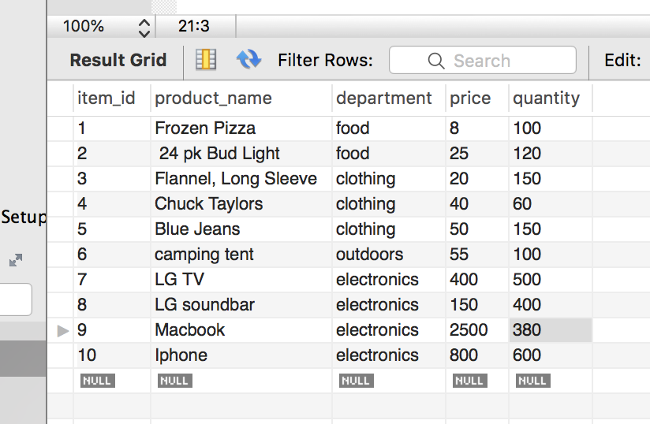

# MySql-node

Using mysql and node.js to create an application called bamazon which allows users users to purchase products. 

A list of questions will ask the user what they would like to do. 

After products have been purched an updated list will appear with the new amount of available product. 

If there is not enough itmes in stock th user will be get a prompt that there is not enough. 

Screenshot of the node.js list

